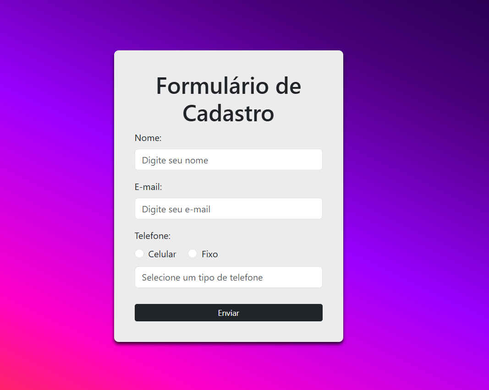

[🇧🇷 Versão em Português](PT-BR-README.md) | [🇺🇸 English Version](README.md)

---

# Registration Form - EBAC

This is a registration form project developed as part of the **EBAC** course. The form is responsive, styled with **Bootstrap**, and uses **jQuery** for dynamic functionalities such as phone masks and validation.

---

## 🖼️ Demo

---

## 🚀 Features

- **Responsiveness**: The form adapts to different screen sizes (desktop, tablet, and mobile).
- **Phone Masks**: Dynamic masks for mobile and landline phone numbers.
- **Validation**: Required fields are validated before submission.
- **Success Message**: A success alert is displayed upon correct form submission.
- **Automatic Reset**: The form is automatically cleared after successful submission.

---

## 🛠️ Technologies Used

- **HTML5**: Form structure.
- **CSS3**: Custom styling and responsiveness.
- **Bootstrap 5**: Responsive layout and styled components.
- **jQuery**: DOM manipulation and dynamic functionalities.
- **jQuery Mask Plugin**: Application of masks to phone fields.

---

## 📂 Project Structure

---

## 🚀 Features

- **Responsiveness**: The form adapts to different screen sizes (desktop, tablet, and mobile).
- **Phone Masks**: Dynamic masks for mobile and landline phone numbers.
- **Validation**: Required fields are validated before submission.
- **Success Message**: A success alert is displayed upon correct form submission.
- **Automatic Reset**: The form is automatically cleared after successful submission.

---

## 🛠️ Technologies Used

- **HTML5**: Form structure.
- **CSS3**: Custom styling and responsiveness.
- **Bootstrap 5**: Responsive layout and styled components.
- **jQuery**: DOM manipulation and dynamic functionalities.
- **jQuery Mask Plugin**: Application of masks to phone fields.

---

## 📂 Project Structure
- **index.html** # Main structure of the form 
- **style.css** # Custom styles
- **script.js** # Dynamic functionalities with jQuery
- **README.md** # Project documentation

---

## 📋 How to Use

1. **Clone the repository**:
- git clone https://github.com/DevMichaelMS/ex12.13_formulario

2. **Open the** index.html file in your browser:

- You can use the **Live Server** extension in VS Code for easier development.

3. **Fill out the form**:
- Choose the phone type (Mobile or Landline).
- Enter the required fields.
- Click "Submit" to see the success message.

---

## 📱 Responsiveness
# The form is designed to work on different devices:

- Desktop: Centered layout with a maximum width of 400px.
- Tablet: Adjustments to text size and spacing.
- Mobile: Compact layout with smaller fonts.

---

## 🛡️ License
- This project is free to use and was developed for educational purposes.

---

## ✨ Autor
- Michael Silva
- Developed as part of the EBAC course.
- If you enjoyed this project, feel free to give a ⭐ on the repository!
